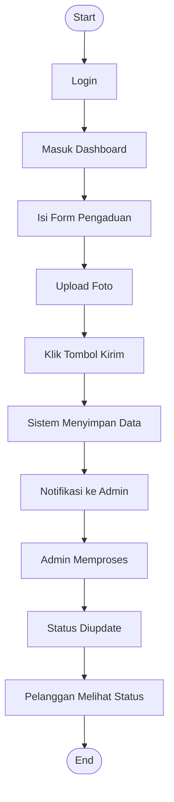

```mermaid
flowchart TD

A([Start]) --> B[Login]

B --> C[Masuk Dashboard]

C --> D[Isi Form Pengaduan]

D --> E[Upload Foto]

E --> F[Klik Tombol Kirim]

F --> G[Sistem Menyimpan Data]

G --> H[Notifikasi ke Admin]

H --> I[Admin Memproses]

I --> J[Status Diupdate]

J --> K[Pelanggan Melihat Status]

K --> L([End])
```