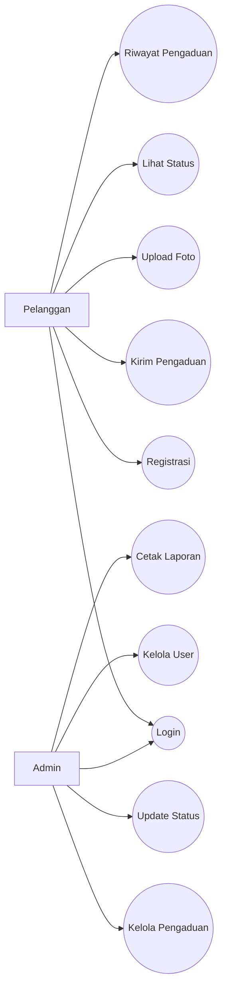

```mermaid
graph LR

P[Pelanggan]
A[Admin]

UC1((Registrasi))
UC2((Login))
UC3((Kirim Pengaduan))
UC4((Upload Foto))
UC5((Lihat Status))
UC6((Riwayat Pengaduan))

UC7((Kelola Pengaduan))
UC8((Update Status))
UC9((Kelola User))
UC10((Cetak Laporan))

P --> UC1
P --> UC2
P --> UC3
P --> UC4
P --> UC5
P --> UC6

A --> UC2
A --> UC7
A --> UC8
A --> UC9
A --> UC10
```