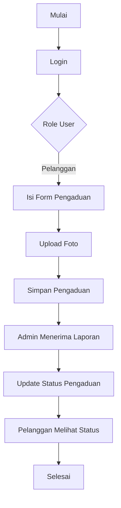

```mermaid
flowchart TD

A[Mulai] --> B[Login]

B --> C{Role User}

C -->|Pelanggan| D[Isi Form Pengaduan]
D --> E[Upload Foto]
E --> F[Simpan Pengaduan]

F --> G[Admin Menerima Laporan]

G --> H[Update Status Pengaduan]

H --> I[Pelanggan Melihat Status]

I --> J[Selesai]
```